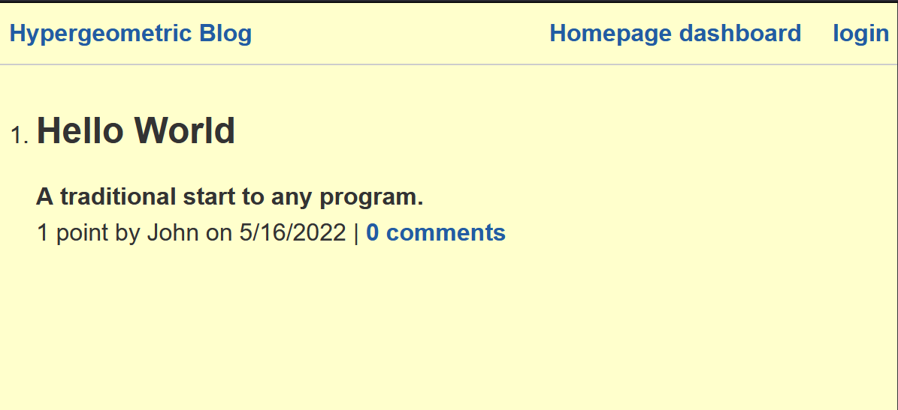
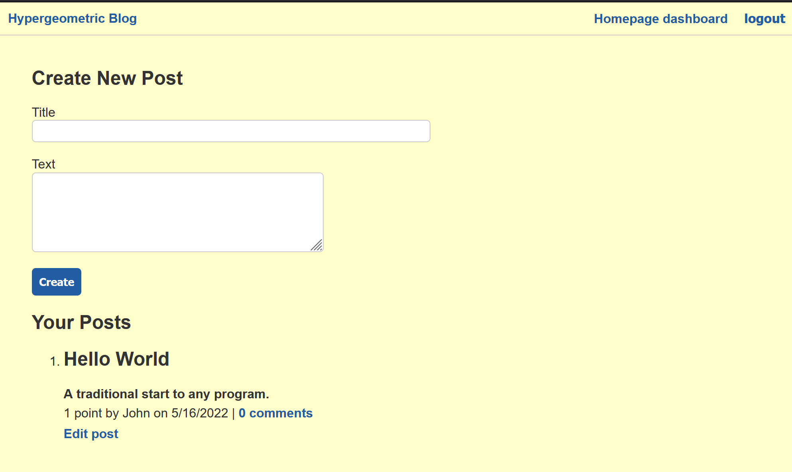

# hypergeometric-blog

## Description

Chat about tech, math, and science on this blog. Upvote posts you like, and tell everyone what you think in the comment section.

## Table of Contents

- [Usage](#usage)
- [Installation](#installation)
- [License](#license)
- [Contributing](#contributing)
- [Tests](#tests)
- [Questions](#questions)

---

## Usage

Visit the deployed site at: [Hypergeometic Blog](https://stark-river-35516.herokuapp.com/)

### Screenshots

## Installation

- Download the repositiry from GitHub
- Install the dependencies by running `npm install`
- You can run the app locally by running `npm start`

## License

Copyright (c) 2022.  
Licensed under the [MIT](https://mit-license.org/) license.

---

## Contributing

You can submit pull requests for expanded functionality, bug fixes, optimisation, and correcting typographical errors. Please be respectful to eachother when you meet, and strive to leave the community and code in a better state than you found it.

## Tests

There are no tests included with this implementation.

## Questions

If you have any questions, my <a href="https://github.com/SrGiovanni">GitHub profile</a> is linked,
or you can email me at <a href = "mailto: example@farsight.c">example@farsight.c</a>.
